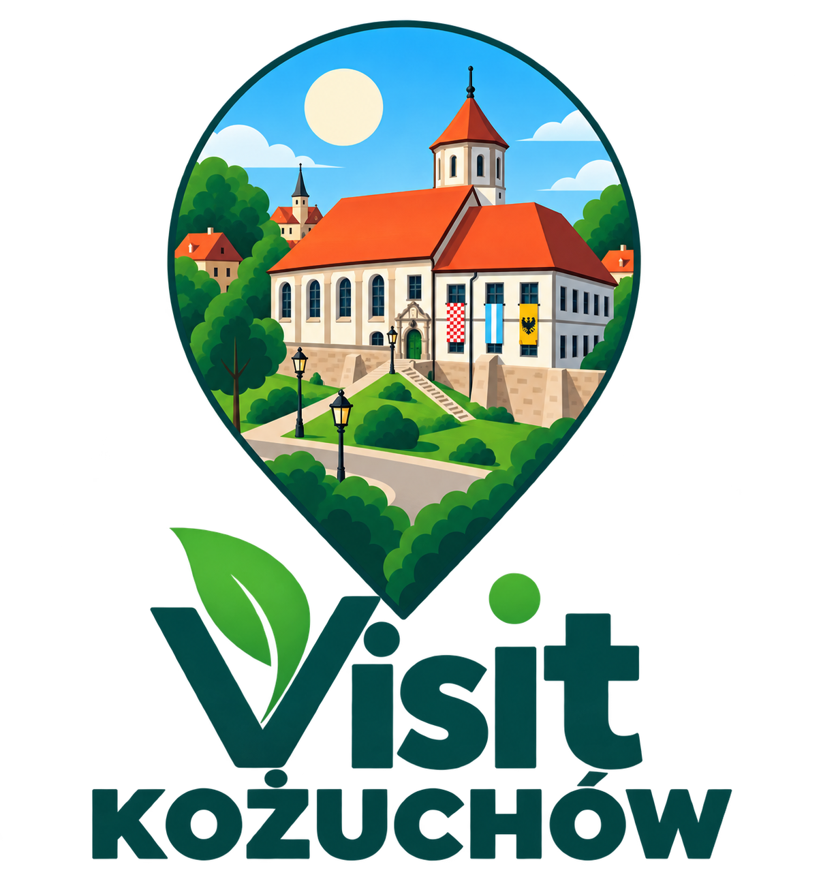
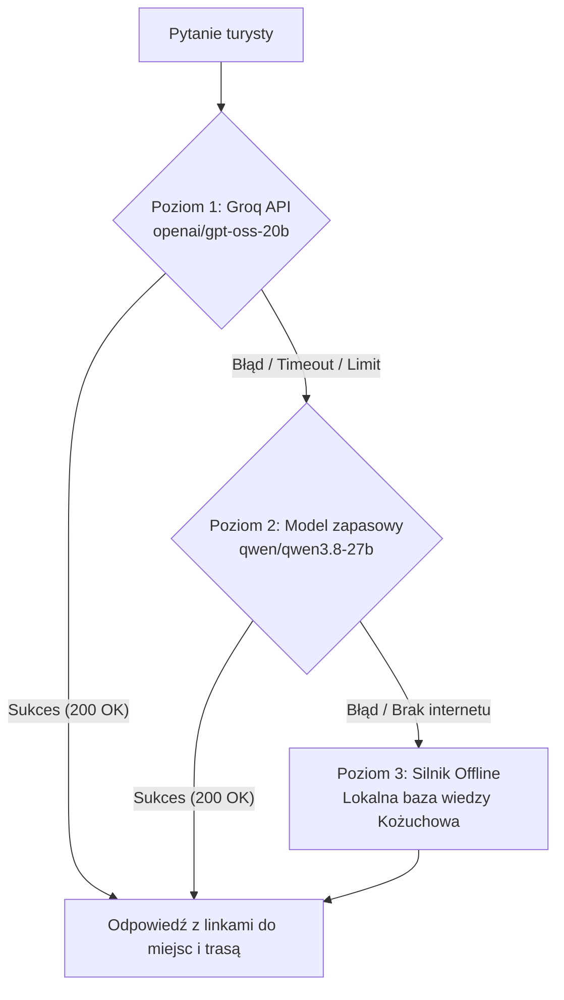

# 🏰 Visit Kożuchów — Interaktywny Przewodnik Turystyczny & Asystent AI

<div align="center">



[](https://reactnative.dev/)
[](https://expo.dev/)
[](https://www.w3.org/WAI/WCAG21/quickref/)
[](https://groq.com/)
[](LICENSE)
[]()

**Nowoczesna, w pełni dostępna (WCAG 2.1 AA) aplikacja mobilna stworzona dla turystów i mieszkańców odkrywających bogatą, średniowieczną historię Kożuchowa.**

[Funkcjonalności](#-kluczowe-funkcjonalności) • [Asystent AI](#-inteligentny-asystent-ai) • [Mapa i Trasy](#-interaktywna-mapa-satelitarna-i-kreator-tras) • [Dostępność WCAG](#-standard-dostępności-wcag-21-aa) • [Instalacja](#-instalacja-i-uruchomienie) • [Struktura](#-struktura-projektu)

</div>

---

## 📖 O projekcie

**Visit Kożuchów** to multimedialny przewodnik turystyczny łączący historyczne dziedzictwo jednego z najstarszych i najlepiej ufortyfikowanych miast w Polsce z najnowocześniejszymi technologiami mobilnymi:
- **Hybrydowa mapa satelitarna** z geolokalizacją GPS w czasie rzeczywistym.
- **Wielopoziomowy asystent sztucznej inteligencji (LLM)** z odpornością na brak sieci (100% Offline Failsafe Engine).
- **Kreator własnych tras turystycznych** i gotowe szlaki tematyczne.
- **Skaner kodów QR** dla tablic informacyjnych w terenie i sal zamkowych.
- **Audioprzewodnik lektorski (TTS)** w języku polskim.
- **Kompleksowe wdrożenie międzynarodowego standardu dostępności WCAG 2.1 (AA)**.

---

## 🌟 Kluczowe funkcjonalności

| Funkcja | Opis |
| :--- | :--- |
| 🏰 **Baza 12 zabytków Kożuchowa** | Szczegółowe opisy historyczne, architektura, godziny otwarcia, dostępność dla wózków, lokalne galerie zdjęć w wysokiej rozdzielczości. |
| 🤖 **Asystent AI (Groq + Offline)** | Konwersacyjny przewodnik odpowiadający na pytania o historię, ciekawostki, gastronomie i odległości. |
| 🛰️ **Mapa satelitarna wysokiej rozdzielczości** | Pełnoekranowy widok hybrydowy (satelita + ulice) z pinezkami GPS, obliczaniem odległości (wzór Haversine) i centrowaniem kamery. |
| 📍 **Kreator tras i szlaki AI** | Możliwość ułożenia własnej trasy spacerowej z ponumerowanymi punktami, linią ścieżki (Polyline) oraz 4 gotowe trasy AI (1h do 2.5h). |
| 📷 **Skaner kodów QR** | Błyskawiczny skaner aparatem kodów obiektów (`KZ-01-PLACE`) oraz ekspozycji muzealnych w Zamku (`KZ-01-ROOM`). |
| 🔊 **Wbudowany audioprzewodnik (TTS)** | Natywna synteza mowy w języku polskim z odtwarzaniem, pauzowaniem, wznawianiem i zatrzymywaniem. |
| 🔍 **Wyszukiwarka i filtry** | Dynamiczne wyszukiwanie z podświetlaniem wyników, podział na kategorie (*Zabytki, Architektura, Parki i Przyroda, Miejsca pamięci*). |
| ♿ **Dostępność WCAG 2.1 AA** | Tryb dla daltonistów, wysoki kontrast (7:1), powiększony tekst, strefy dotyku $\ge 48\times 48\text{ dp}$, wsparcie TalkBack / VoiceOver. |

---

## 🏛️ Zabytki i obiekty w aplikacji

Aplikacja zawiera kompletną, zweryfikowaną bazę 12 najważniejszych obiektów zabytkowych w Kożuchowie:

1. **Zamek w Kożuchowie** (XIII–XIV w., cylindryczny stołp, Sala Rycerska, Izba Regionalna)
2. **Kościół pw. Matki Boskiej Gromnicznej** (XIII w., romańskie ciosy, sztukateria z żaglowcami)
3. **Baszta Krośnieńska** (XIV w., 20-metrowa baszta bramna z ocalałymi strzelnicami)
4. **Mury obronne i fosa** (XIII–XVI w., jeden z najlepiej zachowanych pierścieni fortyfikacji w Europie)
5. **Domek kata** (baszta czatownicza wkomponowana w ciąg murów)
6. **Rynek i Ratusz** (XIII-wieczny układ szachownicowy, gotycka wieża i piwnice)
7. **Lapidarium rzeźby nagrobnej** (XVII w., unikatowa nekropolia z ~200 renesansowymi płytami)
8. **Barokowy portyk i Park Miejski** (1780 r., rzeźby herm, pomnik filozofa Salomona Maimona)
9. **Zabytkowa fasada kamienicy** (XVIII w., ul. Klasztorna, płaskorzeźby św. Piotra i Pawła)
10. **Kościół pw. Świętego Ducha** (przełom XIII/XIV w., świątynia szpitalna ze sklepieniem sieciowym)
11. **Wieża kościoła ewangelickiego** (1826 r., pamiątka po dawnym Kościele Łaski)
12. **Wieża ciśnień** (1908 r., neogotyk i secesja na najwyższym punkcie miasta)

---

## 🤖 Inteligentny Asystent AI

Asystent wykorzystuje **architekturę 3-poziomowej odporności (Resilience Architecture)**, dzięki czemu nigdy nie pozostawia turysty bez odpowiedzi:



- **Kontekst lokalizacyjny:** Asystent zna współrzędne GPS użytkownika i potrafi powiedzieć: *"Do Baszty Krośnieńskiej masz stąd tylko 180 metrów"*.
- **Integracja z nawigacją:** Klikalne znaczniki `[LINK:place_id]` otwierają bezpośrednio kartę zabytku, a `[ROUTE:id1,id2]` generują interaktywną trasę na mapie jednym dotknięciem.

---

## 🗺️ Interaktywna mapa satelitarna i kreator tras

- **Stały widok hybrydowy (Satellite + Labels):** Realistyczne zdjęcia lotnicze z widocznymi zarysami murów, fosy oraz ulic.
- **Ergonomiczne centrowanie kamery:** Kamera automatycznie pozycjonuje zabytek w górnej połowie ekranu, zapobiegając zasłanianiu go przez dolną kartę informacyjną.
- **Kreator własnych tras:** Zaznacz wybrane obiekty, aby otrzymać trasę z ponumerowanymi punktami, szacowanym czasem marszu i łącznym dystansem.
- **Pływający przycisk GPS:** Błyskawiczny powrót do aktualnej pozycji turysty.

---

## ♿ Standard Dostępności WCAG 2.1 (AA)

Projekt został zaprojektowany zgodnie z wymogami dostępności cyfrowej dla osób ze szczególnymi potrzebami:

- **Minimalny rozmiar celu dotykowego (Target Size):** Wszystkie interaktywne elementy posiadają pole dotyku minimum **48×48 dp** (`hitSlop`, `minHeight`, `minWidth`).
- **Wsparcie dla czytników ekranu (TalkBack / VoiceOver):** Kompletne atrybuty `accessible={true}`, `accessibilityLabel`, `accessibilityRole`, `accessibilityHint` oraz stany `accessibilityState`.
- **Tryb dla daltonistów:** Alternatywna, bezpieczna paleta barw (błękity, pomarańcze, szarości) bez konfliktowych par czerwony/zielony oraz dublowanie stanów ikonami i tekstem.
- **Tryb wysokiego kontrastu:** Współczynnik kontrastu tekstu do tła powyżej **7:1**, wyraźne obramowania kart i przycisków.
- **Skalowanie tekstu:** Dynamiczne skalowanie czcionki (`allowFontScaling={true}`) z zabezpieczeniem przed ucinaniem tekstu w kontenerach.

---

## 🛠️ Stos technologiczny

- **Framework:** [React Native](https://reactnative.dev/) `0.86.3`
- **Ekosystem:** [Expo SDK 57](https://expo.dev/)
- **Nawigacja:** [React Navigation 7](https://reactnavigation.org/) (`@react-navigation/native-stack`)
- **Mapy:** [react-native-maps](https://github.com/react-native-maps/react-native-maps) `1.27.2` (Google Maps / Apple Maps Hybrid)
- **Kamera & QR:** [expo-camera](https://docs.expo.dev/versions/latest/sdk/camera/) `57.0.5`
- **Geolokalizacja:** [expo-location](https://docs.expo.dev/versions/latest/sdk/location/) `57.0.20`
- **Synteza mowy:** [expo-speech](https://docs.expo.dev/versions/latest/sdk/speech/) `57.0.3`
- **AI Inference:** [Groq Cloud API](https://groq.com/) (`gpt-oss-20b`, `qwen3.8-27b`)
- **Architektura styli:** Custom Scale Hook (`useScale.js`) z adaptacją do różnych gęstości ekranów (DPI).

---

## 🚀 Instalacja i uruchomienie

### Wymagania wstępne:
- Zainstalowane środowisko [Node.js](https://nodejs.org/) (wersja `>= 18.0.0`)
- Menedżer pakietów `npm` lub `yarn`
- Zainstalowana aplikacja **Expo Go** na telefonie (Android lub iOS) lub skonfigurowany emulator Android Studio / Xcode

### Krok po kroku:

1. **Sklonuj repozytorium:**
   ```bash
   git clone https://github.com/NEYSANS4509/visit-kozuchow.git
   cd visit-kozuchow
   ```

2. **Zainstaluj zależności:**
   ```bash
   npm install
   ```

3. **Skonfiguruj zmienne środowiskowe:**
   Skopiuj plik przykładowy `.env.example` do `.env`:
   ```bash
   cp .env.example .env
   ```
   *(Opcjonalnie)* Wklej swój bezpłatny klucz API z [console.groq.com](https://console.groq.com) do parametru `EXPO_PUBLIC_GROQ_API_KEY`. Jeżeli klucz nie zostanie podany, aplikacja automatycznie użyje wbudowanego silnika wiedzy offline!

4. **Uruchom serwer deweloperski Expo:**
   ```bash
   npx expo start
   ```

5. **Otwórz aplikację:**
   - **Na telefonie:** Zeskanuj kod QR aparatem (iOS) lub aplikacją Expo Go (Android).
   - **Android Emulator:** Naciśnij klawisz `a` w terminalu.
   - **iOS Simulator:** Naciśnij klawisz `i` w terminalu.

---

## 📁 Struktura projektu

```
visit-kozuchow/
├── assets/                  # Zoptymalizowane zasoby graficzne zabytków i ikony
│   ├── logo.png
│   └── places/              # Fotografie 12 zabytków Kożuchowa (PNG/JPG)
├── src/
│   ├── components/          # Komponenty UI wielokrotnego użytku
│   │   ├── AIChatModal.js   # Interaktywny czat z przewodnikiem AI
│   │   └── LegalModal.js    # Modal polityki prywatności i regulaminu
│   ├── context/             # Globalny stan aplikacji (React Context)
│   │   └── AccessibilityContext.js # Zarządzanie trybami WCAG (kontrast, daltonizm, font)
│   ├── data/                # Statyczna baza wiedzy i danych
│   │   ├── places.js        # Baza 12 zabytków, koordynaty GPS, sale zamkowe, opisy
│   │   └── aiKnowledge.js   # Prompt systemowy, baza wiedzy dla AI, generator tras
│   ├── hooks/               # Własne hooki React
│   │   └── useScale.js      # Responsywne skalowanie interfejsu (DPI/Figma)
│   ├── screens/             # Ekrany aplikacji
│   │   ├── WelcomeScreen.js # Ekran powitalny ze statystykami i szybkim startem
│   │   ├── ExploreScreen.js # Główny katalog zabytków, wyszukiwarka i widżet mapy
│   │   ├── MapScreen.js     # Pełnoekranowa mapa satelitarna, trasy i GPS
│   │   ├── CastleDetailScreen.js # Szczegółowa karta zabytku z audioprzewodnikiem TTS
│   │   ├── QRScannerScreen.js   # Pełnoekranowy skaner kodów QR
│   │   └── SettingsScreen.js    # Panel ustawień dostępności WCAG 2.1 AA
│   ├── services/            # Logika biznesowa i integracje API
│   │   ├── aiService.js     # Połączenie z Groq API + 3-stopniowy fallback offline
│   │   └── placesService.js # Filtrowanie, wyszukiwanie i kalkulacje odległości
│   ├── theme/               # Palety kolorów (domyślna, wysoki kontrast, daltonizm)
│   └── utils/               # Narzędzia pomocnicze (imageSource itp.)
├── .env.example             # Szablon zmiennych środowiskowych
├── .gitignore               # Ignorowanie plików środowiskowych, cache i buildów
├── app.json                 # Konfiguracja Expo, uprawnienia kamery i geolokalizacji
├── Info.md                  # Szczegółowa dokumentacja merytoryczna do prezentacji
├── package.json             # Zależności i skrypty npm
└── README.md                # Główny opis projektu dla repozytorium GitHub
```

---

## 📄 Licencja

Projekt udostępniony na licencji **MIT**. Zobacz plik [LICENSE](LICENSE), aby uzyskać więcej informacji.
Wszystkie materiały historyczne i archiwalne o Kożuchowie pochodzą z oficjalnych opracowań regionalnych.
